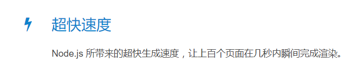

> 文章思路借鉴了网上文章，如有雷同，十分正常。有问题邮箱联系我，页面左上角点开即可看到邮箱

使用travis CI自动化部署Hexo到github pages ，并使用腾讯云的cdn加速国内的访问

# 折腾完成后日常操作流程
`建立md文件->写博客->推送到git->没了`
没错,就是这么简单,熬出头的好处就是什么神都不要烦.写完推送一下等一小会就全部完成了.

# 目录
1. [github pages相关](./2017/09/03/github%20pages%E6%95%99%E7%A8%8B/) (未完成)
1. [hexo相关](./2017/09/03/hexo%E6%95%99%E7%A8%8B/) (未完成)
1. [travis CI相关](./2017/09/03/travis-CI%E6%95%99%E7%A8%8B/) (未完成)
1. [cdn相关](./2017/09/03/cdn%E6%95%99%E7%A8%8B/) (未完成)

# 优缺点
## Hexo的优点
> 摘自官网

## Hexo的缺点

缺点写个p,弄半天不久是为了用这个搭博客嘛.

## github pages的优点
快速的部署静态博客,免费,无空间限制

## github pages的缺点
国内访问速度慢,需要用下文的cdn

## travis CI的优点

1. 换了电脑、换了工作环境、重装系统之后可以迅速恢复状态，发布博客。
2. 备份了博客的源码和网页。
3. 当仓库push后自动部署，不用手动发布。

## travis CI的缺点
1. 当然是开始时变得麻烦了，我一开始弄的时候各种错误差点放弃了
2. 博客的源码公开了，当然这也没什么大不了的，我相信没谁愿意去看我的源码。

## CDN的优点
加速了git在国内的访问速度

## CDN的缺点
麻烦呗,不过玩博客不就是为了折腾嘛。

# 占个坑，有时间补齐详细教程

